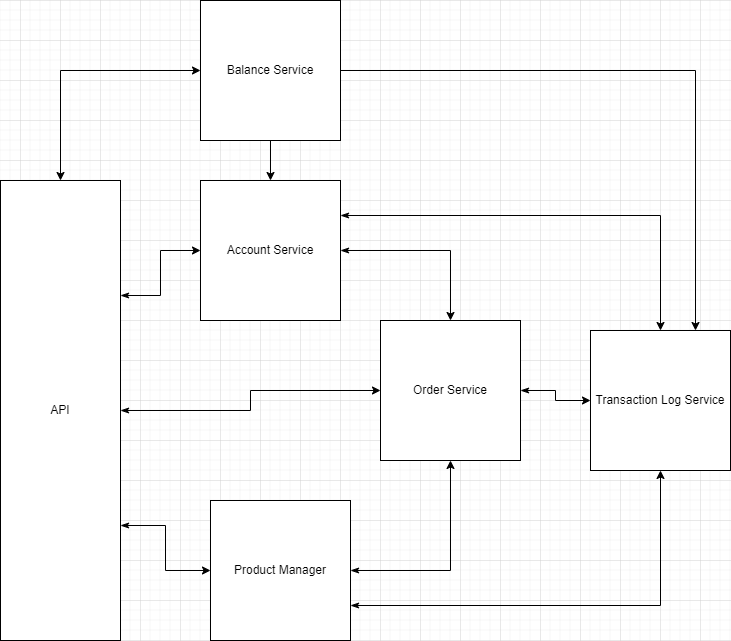

# Introduction to Microservices [DAY 1]

## GCASH Mini
GCash Mini is a financial system that allows a person to send and receive money to someone, and able to buy products offered inside the system such as airtime load, steam credits, etc...

### Lab#1
You are leading a team that will develop the backend system of GCash Mini. Your task is to create an architectural design in microservices approach of the system.

### Challenge#1
Design and document your GCash Mini API\

- User can create account
- Account verification
- Account login
- Add money to account
- Transfer money to an account
- Buy product
- Retrieve account details (personal info and balance)
- Manage products