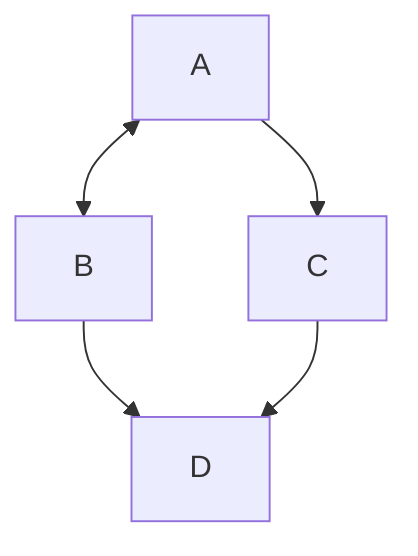

# Introduction to Microservices [DAY 1]

## GCASH Mini
GCash Mini is a financial system that allows a person to send and receive money to someone, and able to buy items offered inside the system such as airtime load, steam credits, etc...

### Lab#1
You are leading a team that will develop the backend system of GCash Mini. Your task is to create an architectural design in microservices approach of the system.

